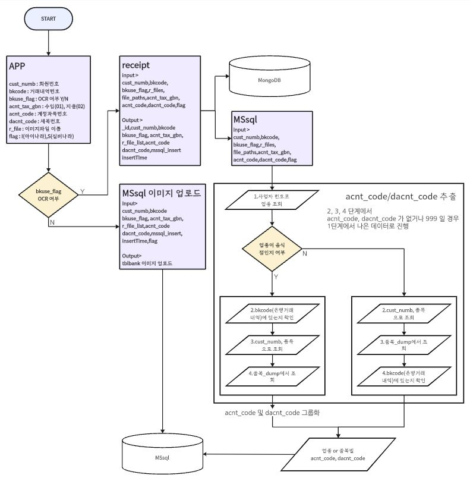

# Receipt_ProJect(영수증 OCR 및 세목 지정 프로젝트)

## config
 - 서버IP 및 정보 저장

## db_mongo
 - DB_info.py (MongoDB, MsSQL 연동 및 명령어 구분 파일)

## 메인 파일
 - fastapi.py (FastAPI 구동)
 - flask_api.py (Flask 구동)
 - log_file.py (loguru 기반의 로그 저장 함수)
 - mssql.py (정제된 데이터를 mssql에 저장)
 - receipt.py (Azure API OCR 데이터를 정체)

## FlowChart

